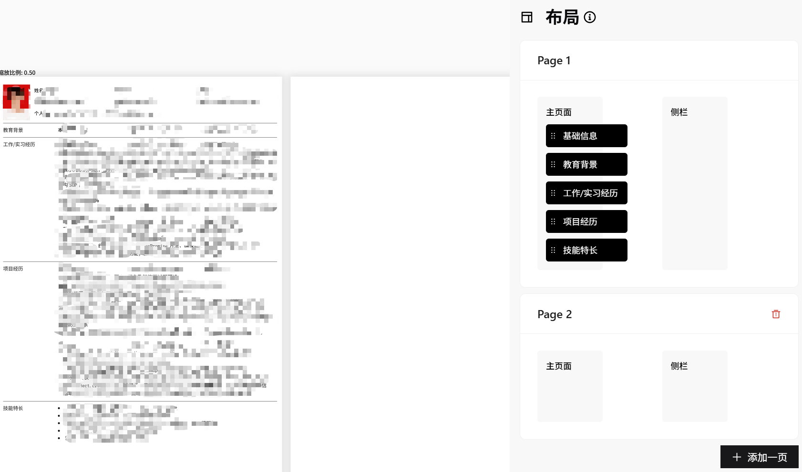

# PDF分页导出技术实现方案演进
1. **背景** 在现有的简历网站中，主要有以下几种实现方案：低代码拖拽、`markdown`渲染、`JSON`数据驱动模板渲染。项目中采用第三种方案，并且初期使用的是`canvas2dom`+`pdfjs`的方案实现`pdf`导出
2. 该方案的本质是先将目标DOM转成canvas图片，再植入pdf中，但遇到了两个本质性限制：
   * 高质量的导出效果依赖于高质量的canvas图像，但浏览器对canvas是存在大小限制的
   * pdf导出不可忽略的一个场景是**分页导出**。由于采用的是JSON驱动模板渲染的方案，所以想到递归时计算各节点位置从而判断是否分页，但动态计算分页存在一些致命问题：
      1. 递归过程中无法准确预判模块跨页时的打断位置，是行级打断还是模块级别的打断
      2. 实习经历等动态内容可能会导致最后一页仅残留半行文本，动态高度计算实现复杂
      3. 对于同一行但不同模块的内容，由于所处高度相同，还要避免做重复计算
3. 于是进行了一次实现方案的迭代，主要受`Canvas可画`的启发，它是一个拖拽式的简历制作网站，但是它在分页时是**用户主导**的
    * 在项目中全局维护一个`Map`来表示`page`与`moduleArray`的映射关系，`key`表示当前页，`moduleArray`表示当前页内需要渲染的模块
    * 并提供页面管理面板，支持用户动态增删简历页数、模块跨页拖拽排序
    * 在渲染简历数据时，换成遍历`Map`的每一页，生成各自独立的`DOM`树，规避动态计算的问题
    * 最终效果见下图👇
4. 但仍然遗留了几个问题：导出质量与`canvas`大小限制的矛盾、生成`canvas`时一些默认样式的丢失
5. 于是考虑其他实现方案，主要包括：
    * 浏览器打印，实现技术成本低，但是需要用户手动交互打印的过程，作为`Toc`的网站，这种实现方案不够完美，且存在**色彩失真** (主要是简历上的照片)
    * 无头浏览器打印，将目标打印内容的`html`+`css`内容传递给服务端，服务端通过无头浏览器模拟渲染，返回二进制文件，前端进行下载。这种方案导出的结果精度高，且不受限于浏览器，自动化程度高，最终采用了这种方案。考虑到安全性，做了一些安全防御的工作，主要包括：
      1. 标签过滤，服务端过滤非安全标签防止`XSS`攻击
      2. **加盐**`hash`加密，防止目标打印内容被篡改
      3. `CSP`策略，阻断无头浏览器加载外部其他资源

> **缺憾：**
> 
> 由于域名注册比较困难，上述仅是建立在`HTTP`的前提下，尽可能能做的安全防护手段。毕竟攻击者完全有可能把内容和哈希值一块篡改了，此时就得借助`HTTPS`的数字签名功能，但是一旦引入了`HTTPS`，很多所谓的优化手段就显得没有必要，比如哈希加密，因为`HTTPS`本身就用的混合加密进行通信

**效果图：**

# 关于AI的尝试：
随着大模型的发展，`AI`+前端是一个新的技术命题。此处抛开“`AI`+人力提效”的话题不谈，记录一下大模型为开发过程/产品功能赋值的探索(非`AI Coding`)
1. 大语言模型具有极强的仿写能力，特别是对简历网站、博客网站等偏文档类的项目来说，具有天然的使用优势
    * 在该项目中，可以让`AI`学习用户的简历某些模块的内容，让`AI`实现简历润色的效果
    * 同时，喂给大模型当前简历的内容，让其为我们预设一些相关的面试题
    * 在提示过程中，为了避免人工智能变成人工智障，保障输出结果的稳定性，往往还需要对`prompt`下一番功夫，如何做好`PE Engineering`也是一个比较宏大的话题
    
2. 前端开发过程中，特别是做一些个人项目时，难免会遇到没有`UI`设计稿、自身审美又捉襟见肘的情况，此时也可以使用一些`AI`工具来辅助我们开发
    * [vo.dev](https://v0.dev/)：以对话的形式给出`Web`原型，在**不耦合业务逻辑代码**的前提下，生成的`UI`质量都比较高
    * `Trae`+`MCP`模式。`MCP`理解成大模型与业务之间的万能插座、中间人，通过`MCP`，我们告诉大模型资源在哪(数据源)、怎么做(不同的`MCP`各有所长)、怎么有效沟通(`prompt`)、怎么传输结果。项目中用到`Figma AI Bridge`这一`MCP`，直接无痛使用`Figma`模板市场中一些好用的原型图。[参考文章](https://juejin.cn/post/7506051295951732748#heading-2)